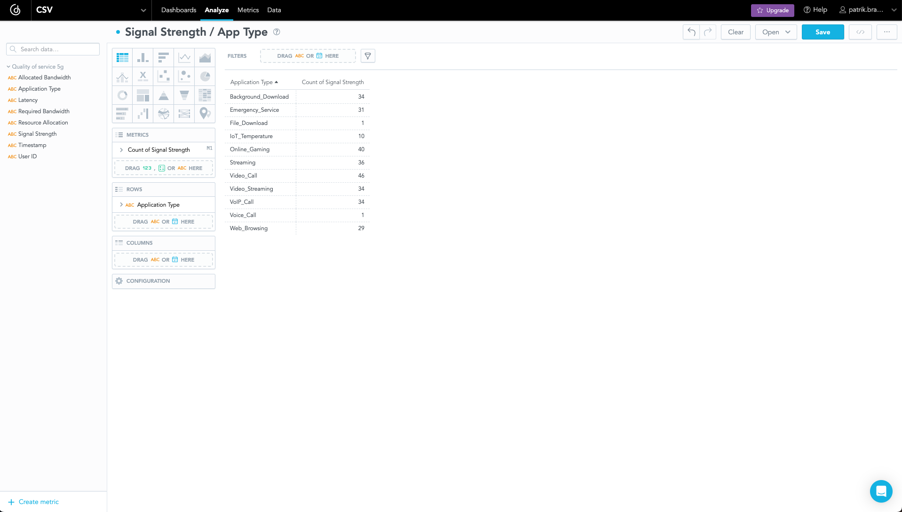

# How to analyze CSV data

If you have data in CSV format and want to analyze it, this short article provides a step-by-step guide on how to achieve such analytics.

## Prerequisites

- GoodData account (if you do not have one, you can register your [free trial](https://www.gooddata.com/trial/))
- Installed dbt Core (you can find installation guide in [dbt documentation](https://docs.getdbt.com/docs/core/installation))

## Step 1: Add CSV to dbt seeds folder

If you use the open-source repository `gooddata-csv-analytics`, go to the `import_csv` folder, where you can place your CSV files.

> [!NOTE]
> dbt comes with an inbuilt csv loader (seeds) to populate your data warehouse with any files you put inside of your project’s seeds folder.

## Step 2: Edit profiles.yml

The `profiles.yml` must contain connection details for your data warehouse (i.e. PostgreSQL). You can find `profiles.yml` on the following path:

```bash
$ ~/.dbt/profiles.yml
```

You can open it with Visual Studio Code:

```bash
$ code ~/.dbt/profiles.yml
```

Now, you can edit your connection details and save them:

```bash
import_csv:
  outputs:

    prod:
      type: <postgres | snowflake | other>
      threads: 1
      host: <host>
      port: <host>
      user: <user>
      pass: <password>
      dbname: <database_name>
      schema: <database_schema>

  target: prod
```

> [!NOTE]
> You can use [Neon](https://neon.tech/), or [Supabase](https://supabase.com/).

## Step 3: Run dbt seed

If you successfully configured the previous steps, you can run the following command in the `import_csv` folder:

```bash
$ dbt seed
```

> [!NOTE]
> I slightly modified the dbt project, so I highly recommend that you maintain the same structure as [import_csv](https://github.com/patrikbraborec/gooddata-csv-analytics/tree/main/import_csv).

If everything went smoothly, you should see the following result:


## Step 4: Connect data source to GoodData

In your GoodData account, go to the `Data` tab and add a data source. You should use the same connection details that you used in [Step 2](#step-2-edit-profilesyml).


> [!NOTE]
> If you need more information, check the [documentation](https://www.gooddata.com/developers/cloud-native/doc/cloud/getting-started/connect-data/).

## Step 5: Analyze CSV data

Open the `Analyze` tab, where you can create metrics and visualizations based on your CSV data.



> [!NOTE]
> Do you need to modify your CSV data? Check [Create SQL Datasets](https://www.gooddata.com/developers/cloud-native/doc/cloud/model-data/create-logical-data-model/create-sql-datasets/) documentation page. This feature can help you with modification.

## Conclusion
If you have any questions or require assistance, don't hesitate to reach us on the [GoodData Slack channel](https://www.gooddata.com/slack/). Willing to try GoodData? Explore the possibilities by signing up for our [free trial](https://www.gooddata.com/trial/) today.